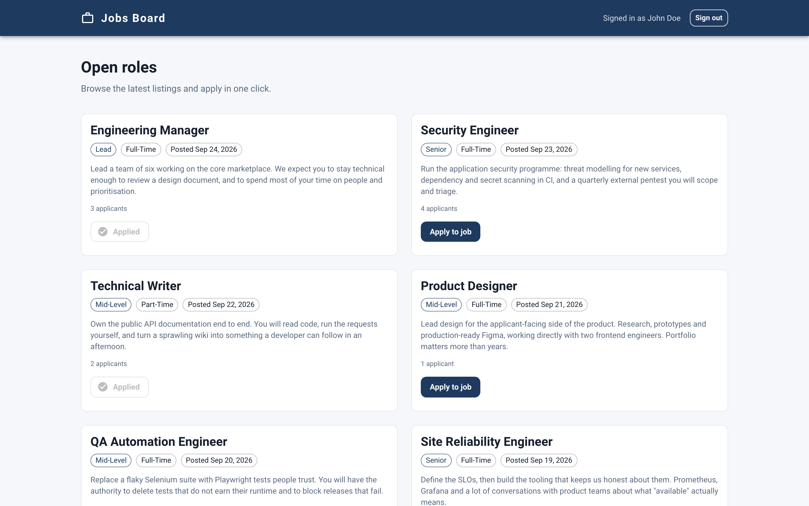
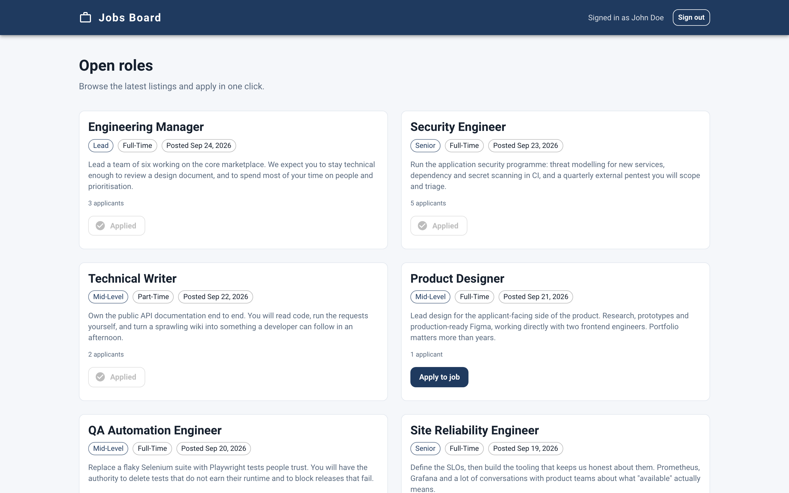
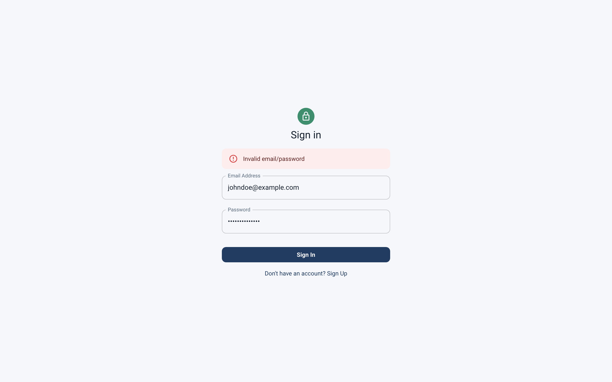
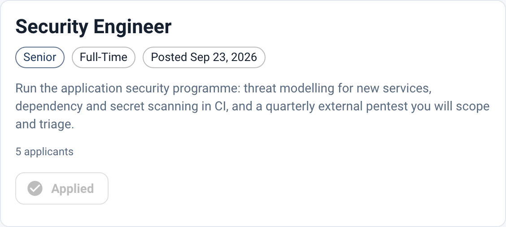
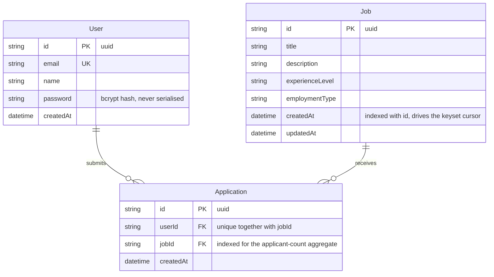
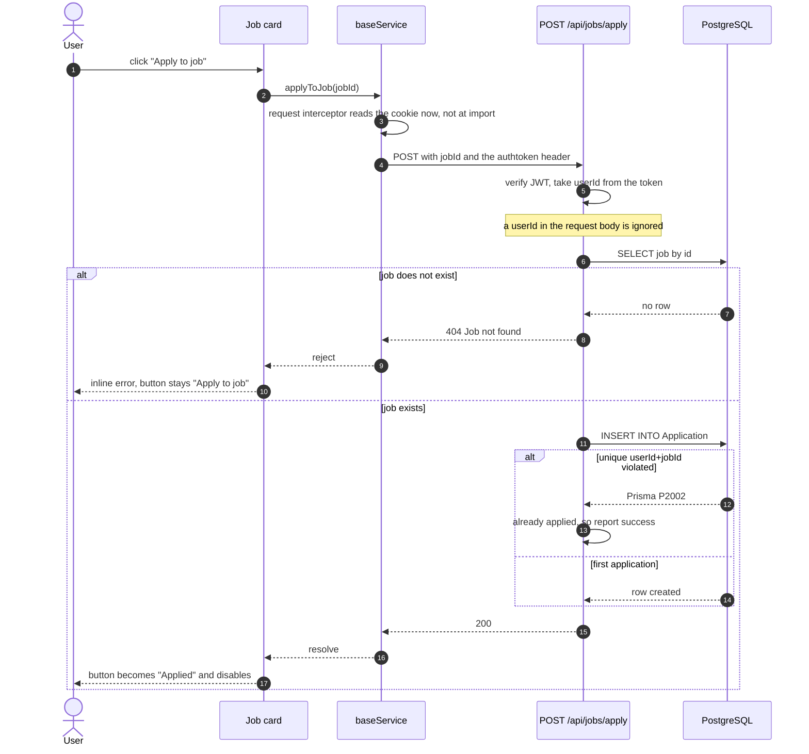

# Jobs Board

A two-package job board: an Express + Prisma API over PostgreSQL, and a React client that
lists open roles and lets a signed-in user apply with one click. Applying is idempotent —
the button flips to "Applied", and a second click (or a second racing request) changes
nothing, because the database will not accept a duplicate. It is deliberately narrow: no
employer side, no job creation, no profile page.



| After applying | Sign in, rejected credentials | A single listing |
| --- | --- | --- |
|  |  |  |

All four were captured by [`docs/e2e-walkthrough.js`](docs/e2e-walkthrough.js) driving the
real app with Playwright at 1440x900 against a seeded database — not mockups. Its output is
in [`docs/e2e-walkthrough.txt`](docs/e2e-walkthrough.txt).

## About the demo data

The roles above are **invented placeholder content**, not real postings. They are a
hand-written array in
[`jobs-server/src/constants/jobs.ts`](jobs-server/src/constants/jobs.ts), loaded by
`prisma db seed`: 12 listings, 6 users, 21 applications between them. The `Job` model is
correspondingly thin — title, description, experience level, employment type, timestamps.
No company, location, salary or closing date, so this is not a model of a real job posting
and should not be read as one. It exists to give the listing, the paging and the applied
state something to render.

One leftover is worth naming rather than hiding: `jobs-web/package-lock.json` still records
the package name `blogs-web`, from the starter the client was built on — no effect on the
build, but it is there if you go looking.

## The data model

Three tables. The interesting one is `Application`, which is a join table and not an array.



Two constraints in [`prisma/schema.prisma`](jobs-server/prisma/schema.prisma) carry most
of the weight. `@@unique([userId, jobId])` on `Application` makes a duplicate impossible at
the database level, so idempotency is not something the application code has to get right
under concurrency — it only has to decide what to do with the rejection. `@@index([createdAt, id])`
on `Job` means the newest-first listing serves both its ordering and its cursor seek from
one index.

The listing endpoint returns `hasApplied` for the caller and an `applicantCount`, and no
applicant identifiers at all — pinned by the cross-user test
`never discloses which users applied to a job`.

## One click, one application

The applicant is taken from the verified token, never from the request body, and the unique
constraint decides the outcome when two requests race.



Three tests in `tests/jobs.test.ts` cover the branches: `is idempotent: applying twice
leaves exactly one application`, `survives concurrent applications from the same user
without duplicating` (five simultaneous requests, all expected to return 200) and
`attributes the application to the token holder, ignoring a userId in the body`.

## Running it

Needs Node 18.16 or newer and a PostgreSQL 14+ you can write to. Verified here on Node
22.22 against PostgreSQL 17.

```bash
cd jobs-server
cp .env.example .env            # then set JWT_KEY — the server refuses to boot without it
yarn install && yarn prisma migrate deploy
yarn seed                       # 6 users, 12 roles, 21 applications
yarn dev                        # http://localhost:8080

cd ../jobs-web                  # second terminal
cp .env.example .env
yarn install && yarn start      # http://localhost:3000
```

Sign in with a seeded demo account: `johndoe@example.com` / `abcd1234`.

`JWT_KEY` has no default and no fallback: `src/config/env.ts` reads it at import and throws
if it is missing, so a misconfigured process fails at boot rather than issuing tokens it
cannot verify. Generate one with `openssl rand -hex 32`.

## Environment

### `jobs-server/.env`

| Variable | Required | Default | Purpose |
| --- | --- | --- | --- |
| `JWT_KEY` | **yes** | none | Secret used to sign and verify JWTs. Throws on boot if unset. |
| `DATABASE_URL` | **yes** | none | Postgres connection string for Prisma. |
| `PORT` | no | `8080` | Port the API listens on. |
| `REACT_APP_URL` | no | `http://localhost:3000` | Origin allowed by CORS. |
| `DEFAULT_PAGE_SIZE` | no | `20` | Jobs returned when the client does not ask for a size. |
| `MAX_PAGE_SIZE` | no | `100` | Ceiling applied to a client-supplied `limit`. |
| `TEST_DATABASE_URL` | no | none | When set, `yarn test` uses this database instead of `DATABASE_URL`. |

### `jobs-web/.env`

`REACT_APP_API_URL` (**required** — base URL of the API including `/api`, inlined into the
bundle at build time) and `PORT` (optional, defaults to `3000`).

### Root `.env` — Docker Compose only

`JWT_KEY` (required, Compose refuses to interpolate without it), `POSTGRES_USER`,
`POSTGRES_PASSWORD`, `POSTGRES_DB`, `API_PORT`, `WEB_PORT`, `PUBLIC_API_URL`, `WEB_ORIGIN`.
Defaults and comments are in [`.env.example`](.env.example).

## Day-to-day commands

| | `jobs-server` | `jobs-web` |
| --- | --- | --- |
| run | `yarn dev` | `yarn start` |
| tests | `yarn test` (mocha, needs a database) | `yarn test` / `yarn test:ci` |
| lint | `yarn lint` | `yarn lint` |
| format | `yarn format` / `yarn format:check` | `yarn format` / `yarn format:check` |
| types | `yarn typecheck` | `yarn typecheck` |
| build | `yarn build` → `dist/` | `yarn build` |
| other | `yarn migrate`, `yarn seed`, `yarn benchmark` | `yarn coverage` |

**61 tests across 7 files** — 31 on the API (mocha, chai, supertest) and 30 on the client
(Jest and React Testing Library). Last run here: `31 passing (3s)`, and
`Test Suites: 5 passed / Tests: 30 passed`.

The API tests are integration tests and write real rows. Set `TEST_DATABASE_URL` to a
throwaway database so a run cannot leave fixtures in your development data; the suites
create everything they need and do not assume the seed has run.

## What the listing endpoint costs

`GET /api/jobs` is the hot path. `jobs-server/scripts/benchmarkListing.ts` (`yarn
benchmark`) builds a copy of the *previous* table shape — a `TEXT[]` of applicant ids on
each job row, returned in full with no paging — next to the current one, so the comparison
is measured rather than estimated. Committed output, in
[`docs/listing-benchmark.txt`](docs/listing-benchmark.txt):

```
Dataset                                             500 jobs, 200 users, 25000 applications
Runs per measurement (median reported)              15
BEFORE  listing query, all rows + applicant arrays  28.1 ms
BEFORE  JSON response size                          1151.8 KiB
BEFORE  applicant ids disclosed to the caller       25000
AFTER   GET /api/jobs over HTTP, one page of 20     2.2 ms
AFTER   HTTP response size                          7.7 KiB
AFTER   applicant ids disclosed to the caller       0
```

Re-running it elsewhere reproduced the payload sizes and disclosure counts exactly
(1151.8 KiB → 7.7 KiB, 25000 ids → 0) and gave 32.5 ms → 2.6 ms for the timings. Treat the
millisecond figures as hardware-dependent and the ratio as the point: roughly 150x less
data on the wire. The gap widens with applicant count, because the old payload grew with it
and the new one does not.

Three things produce the "after" number:

- **`select` instead of everything** — the six fields the card actually renders.
- **A cursor instead of an offset.** `skip` makes Postgres walk and discard every preceding
  row, so page 500 costs five hundred pages of work. Seeking on the indexed
  `(createdAt, id)` pair costs the same for page 500 as for page 1.
- **Three queries, not 1 + N.** A page of 20 needs the jobs, their applicant counts, and
  which of them this caller applied to: one `findMany`, one `groupBy`, one scoped
  `findMany`. That count does not change with page size.

No cache and no queue: at this size they would be decoration, and both would need
invalidating on every application.

## Decisions worth explaining

**Layering, one direction.** `routes → middlewares → controllers → services → lib/prisma`.
Routes bind HTTP. Controllers validate with yup and shape the response envelope, and make
no Prisma calls. Services hold the rules, are the only layer that touches the database, and
raise typed failures from `errors/httpError.ts` (`ConflictError`, `NotFoundError`,
`UnauthorizedError`) which `helpers/exceptionHelper.ts` maps to status codes — an
unexpected 500 is logged in full and answered generically, while 4xx keep their message.
`src/lib/prisma.ts` exports the single client every service imports, so the process holds
one connection pool.

**The session has exactly one home.** `jobs-web/src/services/authStorage.ts` is the source
of truth and `isAuthenticated` is derived from the stored token, so the two cannot
disagree. A 401 from any request clears the session through the axios response interceptor
and hands control to `setUnauthorizedHandler`, which returns the user to sign-in.

**The token is read per request**, inside a `baseService` request interceptor rather than
baked into the instance defaults. `src/services/__tests__/baseService.test.ts` imports the
module before any sign-in and then asserts the header appears, including
`picks up a token that changed since the previous request`.

**Sign-in establishes a session before it navigates.** If the response carries no token the
form shows an error and stays put — `does NOT navigate when the response carries no token`.

**The extension seam is `jobService.listJobs`.** It takes one options object (`userId`,
`title`, `cursor`, `limit`) and returns a `JobPage`. Adding a filter — employment type,
experience level, posted-after — is one field on `ListJobsOptions`, one clause in
`buildWhere` and one line in `listJobsSchema`, with no change to the controller, the route
or the client's service call.

## Where things live

```
jobs-server/
  prisma/      schema.prisma · migrations (incl. the backfill off the old array) · seed.ts
  scripts/     benchmarkListing.ts
  src/
    config/    env.ts — validated at import, throws when JWT_KEY is absent
    lib/       prisma.ts — the one client
    routes/    HTTP binding only: /api/health, /api/auth, /api/jobs
    services/  jobService, userService — the only layer that touches Prisma
    app.ts     builds the Express app and does not listen
    server.ts  binds the port, graceful shutdown on SIGINT/SIGTERM
               (plus middlewares/, controllers/, errors/, helpers/, validationSchemas/)
  tests/       auth.test.ts · jobs.test.ts · root.test.ts · helpers.ts · setup.ts

jobs-web/src/
  pages/       Signin · Signup · Jobs, each with __tests__
  components/  Header · Job · TextInput · Forms · FormContainer · AppRoutes
  contexts/    AuthContext — session state derived from authStorage
  services/    authStorage · baseService · authService · jobService (+ __tests__)
  schemas/     yup validation mirroring the API rules
  theme.ts     one MUI theme · __mocks__/axios.js so no test can hit the network

docs/          screenshots · e2e-walkthrough.{js,txt} · listing-benchmark.txt
```

## Docker: authored, not verified

`jobs-server/Dockerfile` (multi-stage, alpine, non-root `node` user, tini as PID 1 so the
graceful shutdown in `server.ts` receives signals, healthcheck on `/api/health`),
`jobs-web/Dockerfile` (build → nginx on port 8080 as a non-root user, SPA `try_files`
fallback), and a `docker-compose.yml` with a `pg_isready` healthcheck, a one-shot `migrate`
service the API waits on, and an optional `seed` profile.

**Build verified: NOT RUN — deferred, Docker off. Boot verified: NOT RUN — deferred,
Docker off.** The daemon was unavailable where this was written, so only
`docker compose config` — which parses and starts nothing — was run, for both the default
and the `seed` profile. Treat the images as unbuilt.

Once someone does: `cp .env.example .env` (set `JWT_KEY`), then
`docker compose up --build` — the one-shot `migrate` service runs first — and
`docker compose --profile seed up seed` for the demo rows.

## Out of scope

- **No employer side.** Roles come from the seed script or directly from the database.
  There is no endpoint or UI to post, edit or close one.
- **No way to withdraw an application.** Applying is one-way.
- **Title search is API-only.** `GET /api/jobs?title=…` works and is tested; the client has
  no search box.
- **`contains` search is a sequential scan.** Fine at this size; beyond it, it wants a
  trigram index or a full-text column, which this dataset does not justify.
- **Tokens cannot be revoked.** JWTs are stateless and valid for seven days. Signing out
  clears the client's cookies; the token itself stays valid until it expires.
- **Session cookies are not `httpOnly`,** because the client reads them. A successful XSS
  could therefore read the token. The right fix is an `httpOnly` cookie set by the API plus
  a CSRF strategy — a change to the auth design, not made here.
- **No rate limiting** on sign-in or sign-up. Unknown-email and wrong-password take the
  same path and return the same message, but brute force is unthrottled.
- **Applicant counts are aggregated per request,** not cached. **The API tests need a real
  PostgreSQL** — they are integration tests by design.
