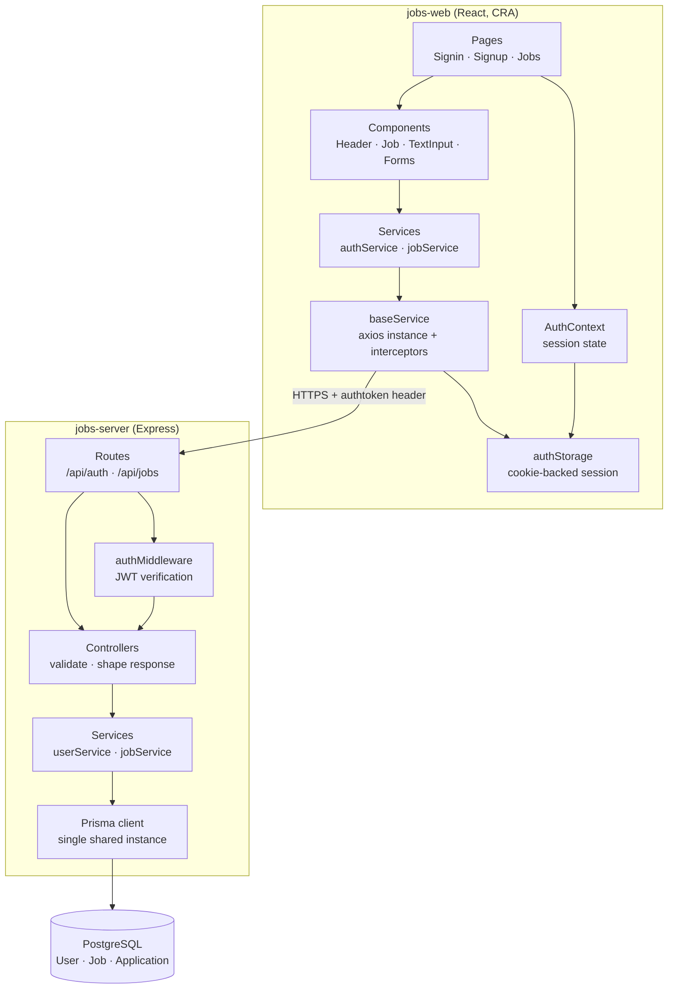
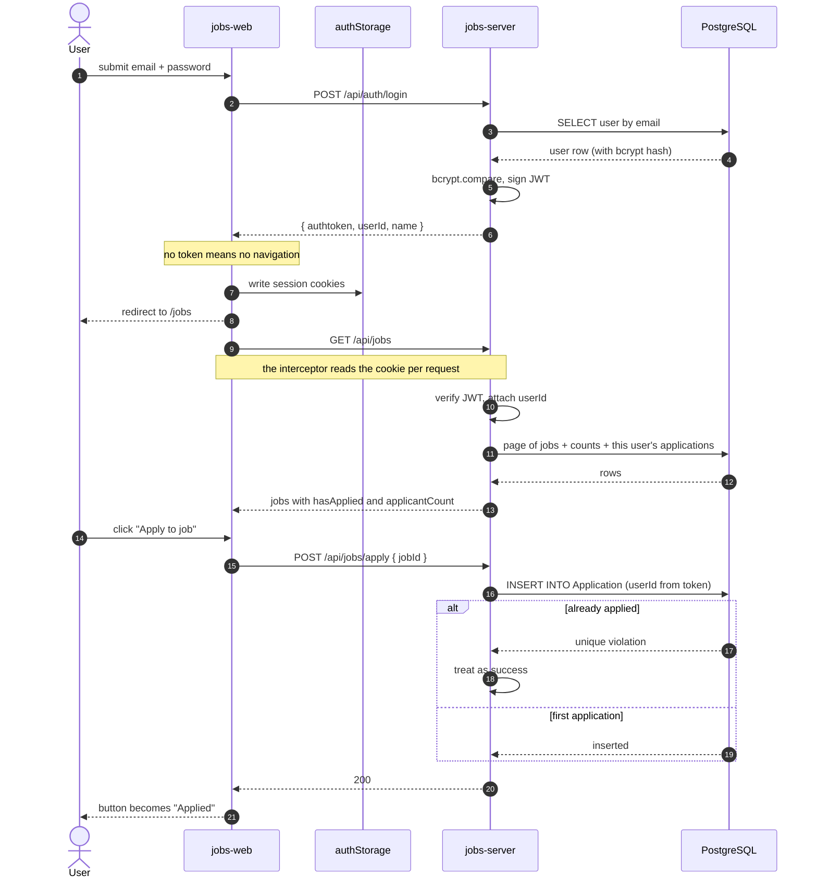

# Jobs Board

A small job board: a Node/Express + Prisma API over PostgreSQL, and a React client that
lists open roles and lets a signed-in user apply to them. Applying is idempotent — the
button becomes "Applied" and the record is enforced unique at the database level.

It is deliberately narrow. There is no employer side, no job creation UI, and no search
box; the API supports title filtering and cursor paging, and the client uses the paging.

## Screenshots

Captured with Playwright at 1440x900 against the running app and a seeded database
(`docs/e2e-walkthrough.js`).

| Job listings, signed in | After applying |
| --- | --- |
|  |  |

| Sign in, rejected credentials | A single listing |
| --- | --- |
|  |  |

## Architecture

The API is layered: routes bind HTTP, controllers validate and translate, services hold
the business rules, and only the service layer talks to Prisma. Dependencies point inward
— a service knows nothing about Express, and a controller knows nothing about SQL.



## Applying to a job

The applicant is always taken from the verified token, never from the request body, and
the unique `(userId, jobId)` constraint makes a duplicate impossible even when two
requests race.



## Quickstart

Requires Node 18.16 or newer (verified on 18.16 and 22) and a running PostgreSQL 14+.

```bash
# API
cd jobs-server
cp .env.example .env            # then set JWT_KEY — the server refuses to boot without it
yarn install
yarn prisma migrate deploy
yarn seed                       # 6 users, 12 roles, 21 applications
yarn dev                        # http://localhost:8080

# Client, in a second terminal
cd jobs-web
cp .env.example .env
yarn install
yarn start                      # http://localhost:3000
```

Sign in with the seeded demo account: `johndoe@example.com` / `abcd1234`.

With Docker (see [Docker](#docker) for status):

```bash
cp .env.example .env            # set JWT_KEY
docker compose up --build       # migrations run automatically before the API starts
docker compose --profile seed up seed
```

## Configuration

### `jobs-server/.env`

| Variable | Required | Default | Purpose |
| --- | --- | --- | --- |
| `JWT_KEY` | **yes** | none | Secret used to sign and verify JWTs. The process throws on boot if unset. |
| `DATABASE_URL` | **yes** | none | Postgres connection string for Prisma. |
| `PORT` | no | `8080` | Port the API listens on. |
| `REACT_APP_URL` | no | `http://localhost:3000` | Origin allowed by CORS. |
| `DEFAULT_PAGE_SIZE` | no | `20` | Jobs returned when the client does not ask for a size. |
| `MAX_PAGE_SIZE` | no | `100` | Ceiling applied to a client-supplied `limit`. |
| `TEST_DATABASE_URL` | no | none | When set, `yarn test` uses this database instead of `DATABASE_URL`. |

### `jobs-web/.env`

| Variable | Required | Default | Purpose |
| --- | --- | --- | --- |
| `REACT_APP_API_URL` | **yes** | none | Base URL of the API, including `/api`. Inlined at build time. |
| `PORT` | no | `3000` | Port the dev server listens on. |

### Root `.env` (Docker Compose only)

| Variable | Required | Default | Purpose |
| --- | --- | --- | --- |
| `JWT_KEY` | **yes** | none | Passed to the API container; Compose refuses to start without it. |
| `POSTGRES_USER` | no | `jobs` | Database user created by the `db` service. |
| `POSTGRES_PASSWORD` | no | `jobs` | Database password. |
| `POSTGRES_DB` | no | `jobs-db` | Database name. |
| `API_PORT` | no | `8080` | Host port mapped to the API. |
| `WEB_PORT` | no | `3000` | Host port mapped to the web container. |
| `PUBLIC_API_URL` | no | `http://localhost:8080/api` | API URL baked into the client bundle at build time. |
| `WEB_ORIGIN` | no | `http://localhost:3000` | Origin the API accepts via CORS. |

## Development

```bash
# jobs-server
yarn dev           # nodemon
yarn test          # mocha + chai + supertest — needs a database
yarn lint          # eslint
yarn format        # prettier
yarn typecheck     # tsc --noEmit
yarn build         # tsc -> dist/
yarn benchmark     # listing benchmark, see Design notes

# jobs-web
yarn start
yarn test          # jest + React Testing Library (watch mode)
yarn test:ci       # single run
yarn lint
yarn format
yarn typecheck
```

The API tests write real rows. Set `TEST_DATABASE_URL` to a throwaway database so the
suite cannot leave fixtures in your development data; the tests create everything they
need and do not depend on the seed having been run.

## Project structure

```
jobs-server/
  prisma/
    migrations/           # SQL migrations, including the backfill from the old array column
    schema.prisma         # User, Job, Application
    seed.ts               # demo users, roles and applications
  scripts/
    benchmarkListing.ts   # reproduces the numbers in Design notes
  src/
    config/env.ts         # validated environment; throws on boot if JWT_KEY is missing
    lib/prisma.ts         # the single Prisma client for the process
    routes/               # HTTP binding only
    middlewares/          # JWT verification
    controllers/          # validation and response shaping
    services/             # business rules; the only layer that touches Prisma
    validationSchemas/    # yup schemas for bodies and query strings
    errors/               # HttpError and friends, mapped to status codes
    helpers/              # response envelope, async error wrapper, bcrypt
    app.ts                # builds the Express app (does not listen)
    server.ts             # binds the port, handles graceful shutdown
  tests/                  # mocha suites: auth, jobs, ownership

jobs-web/
  src/
    pages/                # Signin, Signup, Jobs (each with __tests__)
    components/           # Header, Job, TextInput, Forms, FormContainer, AppRoutes
    contexts/AuthContext  # session state, derived from the stored token
    services/
      authStorage.ts      # the single source of truth for the session
      baseService.ts      # axios instance; attaches the token per request
      authService.ts      # login / signup
      jobService.ts       # list / apply
    schemas/              # yup validation, mirroring the API rules
    theme.ts              # one MUI theme for the whole app
    __mocks__/axios.js    # no test can make a real network call

docs/
  screenshots/            # the images above
  e2e-walkthrough.js      # Playwright script that captured them
  e2e-walkthrough.txt     # its output
  listing-benchmark.txt   # output of yarn benchmark
```

## Design notes

**Layering.** Business logic lives in `src/services`. Controllers validate input, call a
service and shape a response; they contain no Prisma calls. This is what makes the
ownership rule testable in isolation: "the applicant is the token holder" is one line in
a controller, not a detail buried in a query.

**One Prisma client.** The codebase previously constructed `new PrismaClient()` in three
modules, giving the process three connection pools against one database. There is now a
single instance in `src/lib/prisma.ts`.

**Applications are a join table, not an array.** `Job.applications` used to be a
`TEXT[]` of user ids. That shape caused three separate problems, and replacing it fixed
all three at once:

- *Correctness.* Appending an applicant meant reading the array, pushing to it and
  writing it back. Two concurrent applications could lose one another's write. A unique
  `(userId, jobId)` index now makes duplicates impossible, and the loser of a race is
  reported as success because applying twice should be idempotent.
- *Disclosure.* The array was serialised to every client on every listing request, so any
  signed-in user could read exactly who had applied to what. The API now returns
  `hasApplied` for the caller and an `applicantCount`, and no applicant ids at all.
- *Cost.* The listing had no `take`, no `select` and no index, so it returned every row
  with every applicant id attached.

**The measured bottleneck.** `GET /api/jobs` was the hot path and the array was what made
it expensive. `yarn benchmark` builds a copy of the old schema alongside the new one and
measures both; this is the output of a real run, reproduced in
[`docs/listing-benchmark.txt`](docs/listing-benchmark.txt):

```
Dataset                                             500 jobs, 200 users, 25000 applications
Runs per measurement (median reported)              15
BEFORE  listing query, all rows + applicant arrays  28.1 ms
BEFORE  JSON response size                          1151.8 KiB
BEFORE  applicant ids disclosed to the caller       25000
AFTER   GET /api/jobs over HTTP, one page of 20     2.2 ms
AFTER   HTTP response size                          7.7 KiB
AFTER   applicant ids disclosed to the caller       0
```

That is ~150x less data over the wire and an order of magnitude less time, and the gap
widens with the number of applicants because the old payload grew with them while the new
one does not.

**Cursor paging, not offset.** `skip` makes Postgres walk and discard every preceding
row, so page 500 costs five hundred pages of work. The listing pages on the indexed
`(createdAt, id)` pair instead, which costs the same for page 500 as for page 1.

**Three queries, not N+1.** A page of 20 jobs needs the jobs, their applicant counts, and
which of them this caller has applied to. That is one `findMany`, one `groupBy` and one
scoped `findMany` — three queries regardless of page size, rather than two extra queries
per job.

**The session has one home.** Authentication state used to live in two places: a boolean
in `localStorage` and the token in a cookie. They could disagree — clearing the cookie
left the app convinced it was signed in, rendering a page whose every request then failed.
Everything now derives from `authStorage`, and a 401 from any request clears the session
and returns the user to sign-in.

**The token is read per request.** `baseService` reads the cookie inside an axios request
interceptor. It used to read it once when the module was first imported — before anyone
had signed in — so the value baked into the instance defaults was permanently `undefined`.
`getJobs` papered over this by passing the header explicitly; `applyToJob` did not, so
applying never worked. `src/services/__tests__/baseService.test.ts` pins the behaviour.

**Extension seam.** `src/services/jobService.ts` is the seam a future developer would
actually need. `listJobs` takes a single options object (`userId`, `title`, `cursor`,
`limit`) and returns a `JobPage`; adding a filter — employment type, experience level,
posted-after — means one field on `ListJobsOptions`, one clause in `buildWhere` and one
line in the query schema, with no change to the controller, the route or the client's
service call. The yup schemas in `validationSchemas/` are the matching seam for input
rules.

**Failing closed on configuration.** `src/config/env.ts` validates the environment at
import time and throws if `JWT_KEY` is absent. Previously login signed tokens with a
fallback literal while the middleware verified against `process.env.JWT_KEY`; with the
variable unset, login succeeded and then every protected route rejected the token it had
just issued.

## Docker

`Dockerfile`s for both services and a `docker-compose.yml` are included: multi-stage
builds, non-root runtime users, healthchecks, and a one-shot `migrate` service that the
API waits on. **They have not been built or booted** — the Docker daemon was unavailable
in the environment where this work was done, so only `docker compose config` (which parses
and starts nothing) was run against them. Treat the images as unverified until someone
builds them.

## Limitations

- **No employer side.** Jobs can only be created by the seed script or directly in the
  database. There is no endpoint or UI to post, edit or close a role.
- **No way to withdraw an application.** Applying is one-way.
- **Title search is API-only.** `GET /api/jobs?title=…` works and is tested; the client
  has no search box.
- **`contains` search does not scale.** It is a sequential scan. At a size where that
  matters it wants a trigram index or a real full-text column, which this dataset does not
  justify.
- **Tokens cannot be revoked.** JWTs are stateless and valid for seven days; signing out
  clears the client's cookies but the token itself remains valid until it expires.
- **Session cookies are not `httpOnly`.** They are written by JavaScript so the client can
  read them, which means a successful XSS could read the token. Moving to an `httpOnly`
  cookie set by the API is the right fix and is not done here.
- **No rate limiting** on sign-in or sign-up.
- **Applicant counts are not cached.** They are aggregated per request, which is fine at
  this size and would want a counter cache well before it is not.
- **The API tests need a real PostgreSQL.** They are integration tests by design; there is
  no in-memory substitute.
